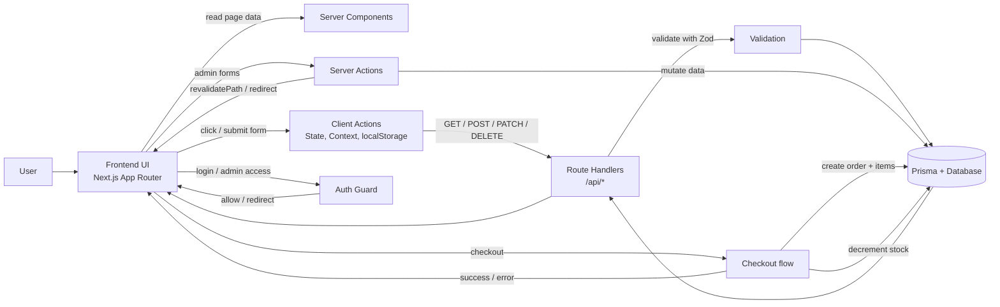

# MiniShop Course Design

Date: 2026-05-11
Status: Updated after core implementation review
Scope: 10-buổi core course project cho Next.js App Router, giữ JavaScript, build dần một e-commerce mini-shop full-stack, kèm 2 buổi nâng cao optional.

## 1. Mục tiêu

Xây một project học React + Next.js theo kiểu "build while learning":

- Có storefront: landing, listing, detail, cart, checkout, order success.
- Có backend: database, REST API, order flow, admin CRUD, auth/protect route.
- Có lộ trình 10 buổi core, mỗi buổi là 1 milestone độc lập, cộng thêm 2 buổi nâng cao optional.
- Có tài liệu giảng dạy đi kèm để dùng trực tiếp khi dạy hoặc tự học.

Project đích: `MiniShop` - cửa hàng sneaker demo. Có thể đổi sang áo thun, mỹ phẩm, hoặc đồ công nghệ nhưng cấu trúc giữ nguyên.

## 2. Ràng buộc

- Giữ JavaScript hiện tại, không migrate sang TypeScript trong phase này.
- Bám Next.js App Router.
- Ưu tiên chạy được trước, tối ưu sau.
- Mỗi milestone phải có output nhìn thấy được trong browser.
- Không mở rộng scope ra ngoài requirement gốc của core track nếu chưa cần.

## 3. Kiến trúc học tập

Course được thiết kế theo 3 lớp:

1. Theory: giải thích khái niệm cốt lõi.
2. Demo: dựng phần chạy được ngay trong buổi học.
3. Practice: bài tập, mở rộng, và checklist tự kiểm tra.

Mỗi milestone đều có 5 phần:

- Mục tiêu buổi học.
- Lý thuyết cần hiểu.
- Demo code trong buổi.
- Thực hành/bài tập.
- Tiêu chí hoàn thành.

Mỗi milestone cũng nên có 1 lớp dạy phụ:

- Speaker notes: câu nói/ý chính để giảng viên dùng khi đứng lớp.
- Quick check: 2-3 câu hỏi chốt xem người học đã hiểu chưa.
- Misconception traps: các hiểu nhầm thường gặp để sửa ngay trên lớp.

## 4. Chọn giải pháp kỹ thuật

Baseline:

- Next.js App Router.
- React 19.
- JavaScript.
- Tailwind CSS nếu project hiện tại đã sẵn hoặc cài ở milestone đầu.
- Prisma cho DB.
- Zod cho validation.
- `localStorage` hoặc Context cho cart giai đoạn đầu.

Lý do:

- App Router phù hợp cho cả UI, route, server component, route handler, server action.
- JS giúp giảm ma sát ban đầu cho người học.
- Prisma giúp course có DB thật mà vẫn type-safe ở tầng query khi chuyển sang phase backend.
- Zod giúp dạy validation rõ ràng, dễ debug.

## 5. Cấu trúc cuối khóa

Core target structure:

- `src/app`
- `src/components`
- `src/lib`
- `prisma`
- `docs`

Advanced additions:

- auth/session tables hoặc auth provider config tương ứng giải pháp được chọn
- E2E/CI config và workflow files
- docs deploy/migration/checklists production-aware

Route map cuối khóa:

Core routes:

- `/` landing
- `/products` listing
- `/products/[slug]` detail
- `/cart`
- `/checkout`
- `/order-success`
- `/login`
- `/admin`
- `/admin/products`
- `/admin/products/new`
- `/admin/products/[id]/edit`
- `/admin/orders`
- `/admin/orders/[id]`
- `/api/products`
- `/api/products/[id]`
- `/api/categories`
- `/api/orders`

Advanced routes / surfaces:

- `/admin/categories`
- `/register` hoặc auth screen tương ứng giải pháp được chọn
- `/api/orders/[id]` nếu buổi nâng cao chọn dạy order detail/update bằng REST thay vì chỉ qua server action
- CI workflow và E2E specs cho các flow quan trọng

## 6. Teaching design

Mỗi buổi học sẽ có tài liệu giảng dạy kèm theo để người học bám được logic:

- Kiến thức chính.
- Từ khóa cần nhớ.
- Mẫu code tối thiểu.
- Lỗi thường gặp.
- Bài tập về nhà.
- Tiêu chí pass.

Nguyên tắc biên soạn:

- Giải thích từ đơn giản đến phức tạp.
- Mỗi concept chỉ gắn 1 ví dụ chính.
- Ưu tiên mô tả data flow hơn là chỉ liệt kê code.
- Nếu có phần khó, viết “vì sao” trước “làm thế nào”.
- Mỗi mục `Lý thuyết` nên giữ 4-6 dòng, mỗi dòng là 1 ý chính, không lặp lại cùng một khái niệm dưới nhiều cách nói.

## 7. Milestone 1 - Buổi 1: Setup + Landing Page

### Mục tiêu

Tạo nền tảng project, hiểu App Router, dựng landing page bán hàng.

### Lý thuyết

- React component: 1 hàm nhận input và trả về UI.
- JSX: Javascript+XML cú pháp viết UI gần với HTML ngay trong JS.
- Server Component: render ở server, hợp cho UI tĩnh hoặc data có sẵn.
- App Router + `layout.js`/`page.js`: routing theo folder, layout bọc chung, page là nội dung riêng.
- Composition + landing flow: ghép component nhỏ thành trang lớn, landing nên dẫn người dùng qua hero, CTA, featured products.

### Code demo gắn với lý thuyết

- `component`: nhận `props` rồi trả UI.

```jsx
function SiteHeader() {
  return <header>MiniShop</header>;
}
```

- `layout.js`: bọc toàn bộ app.

```jsx
export default function RootLayout({ children }) {
  return <html><body>{children}</body></html>;
}
```

- `page.js`: nội dung riêng của route.

```jsx
export default function HomePage() {
  return <main>Landing page</main>;
}
```

### Demo

- Sửa root layout.
- Tạo header, hero, featured section.
- Dựng homepage với nội dung tĩnh.

### Thực hành

- Tách `SiteHeader`.
- Tách `HeroSection`.
- Tạo `FeaturedProducts`.
- Dựng 3 card sản phẩm tĩnh.

### Bài tập

- Thay brand theo ý muốn.
- Chỉnh content hero.
- Làm nav link hoạt động.

### Tiêu chí hoàn thành

- Vào `/` thấy landing page có cấu trúc rõ.
- Có header, hero, CTA, featured products.

### Lesson outline

1. Warm-up: hỏi “1 landing page tốt cần gì để người dùng không thoát ngay?”
2. Concept 1: React component là gì, render ra UI thế nào.
3. Concept 2: `layout.js` và `page.js` trong App Router.
4. Demo: sửa root layout, tạo header, hero, featured section.
5. Checkpoint: giải thích lại luồng render từ layout xuống page.
6. Practice: tách `SiteHeader`, `HeroSection`, `FeaturedProducts`.
7. Review: chỉ ra những phần còn tĩnh và những phần có thể data hóa ở buổi sau.

### Speaker notes

- Mở bài bằng câu hỏi: nếu landing page chỉ có chữ và nút bấm, người dùng có ở lại không?
- Nói component như “viên gạch UI” để người học hình dung đây không phải khái niệm trừu tượng.
- Khi giảng `layout.js`, nhấn mạnh nó là khung bao quanh nhiều trang, giống “vỏ ngoài” của app.
- Khi giảng `page.js`, nói đây là phần nội dung thay đổi theo từng route.
- Dừng lại ở điểm: buổi này chưa cần dữ liệu động, mục tiêu là học cách ghép UI thành trang hoàn chỉnh.
- Nếu học viên hỏi “sao chưa dùng state”, giải thích: chưa cần, vì đây là nền tảng render tĩnh.

### Quick check

- Component khác gì so với một khối HTML copy-paste?
- `layout.js` và `page.js` mỗi file chịu trách nhiệm phần nào?
- Vì sao buổi 1 chưa cần state hay API?

### Misconception traps

- Dễ nhầm App Router chỉ là “đổi tên folder”, trong khi điểm chính là cấu trúc route + layout + data flow.
- Dễ nghĩ landing page tĩnh là “đơn giản nên không quan trọng”, nhưng đây là nơi luyện composition và chia section.

## 8. Milestone 2 - Buổi 2: Product Listing Tĩnh

### Mục tiêu

Hiển thị danh sách sản phẩm bằng component, props, map, conditional rendering.

### Lý thuyết

- Props: cách truyền data từ component cha xuống component con.
- `map()`: sinh list UI từ mảng data.
- Conditional rendering: chỉ render phần UI cần thiết theo trạng thái data.
- Product model: tối thiểu gồm tên, giá hiện tại, giá gốc, slug, ảnh, trạng thái tồn kho.
- Format tiền + badge sale/stock: helper giúp giá nhất quán, badge thể hiện trạng thái sản phẩm.

### Code demo gắn với lý thuyết

- `props`: cha truyền `product` xuống card.

```jsx
function ProductCard({ product }) {
  return <h2>{product.name}</h2>;
}
```

- `map()`: render list từ cùng một catalog.

```jsx
{products.map((product) => (
  <ProductCard key={product.slug} product={product} />
))}
```

- `conditional rendering`: sale / hết hàng.

```jsx
{product.originalPrice ? <span>Sale</span> : null}
{!product.inStock ? <span>Hết hàng</span> : null}
```

- format tiền: tách helper riêng.

```jsx
function formatVnd(value) {
  return new Intl.NumberFormat("vi-VN").format(value) + "đ";
}
```

### Demo

- Tạo mock data dùng chung cho homepage và `/products`.
- Tạo helper `formatVnd`.
- Nâng cấp `ProductCard`.
- Tạo `/products`.

### Thực hành

- Format tiền VND.
- Badge sale nếu có `originalPrice`.
- Badge trạng thái còn hàng/hết hàng.
- Tạo featured products từ cùng data.
- Dùng cùng catalog cho homepage và listing page.

### Bài tập

- Thêm filter giả lập bằng state tĩnh.
- Đổi theme card.

### Tiêu chí hoàn thành

- `/products` render đúng danh sách.
- Card hiển thị giá hiện tại, giá gốc, sale badge, stock state đúng.

### Lesson outline

1. Warm-up: hỏi “render nhiều sản phẩm bằng cách viết tay hay loop sẽ tốt hơn?”
2. Concept 1: props truyền data từ đâu sang đâu.
3. Concept 2: `map()` biến mảng thành danh sách UI như thế nào.
4. Concept 3: conditional rendering cho sale và hết hàng.
5. Demo: tạo mock data, `ProductCard`, `/products`.
6. Checkpoint: test 1 sản phẩm có sale và 1 sản phẩm hết hàng.
7. Practice: format tiền VND, thêm featured section dùng chung data.
8. Review: nhắc lại khi nào nên tách helper format tiền.

### Speaker notes

- Dẫn vào bằng việc cho học viên nhìn 3 sản phẩm tĩnh, sau đó hỏi: có cách nào viết ít code hơn không?
- Giải thích props là luồng dữ liệu một chiều từ cha xuống con, không phải “biến toàn cục”.
- Khi nói `map()`, nhấn mạnh mục tiêu là sinh UI từ data, không copy-paste card.
- Với conditional rendering, dùng ví dụ sale/hết hàng để học viên thấy UI đổi theo data.
- Chốt bằng thông điệp: khi list tăng từ 3 lên 30 sản phẩm, cách này vẫn giữ code gọn.
- Nếu lớp yếu, nhắc lại format tiền là logic helper chứ không nên viết lặp trong JSX.

### Quick check

- Vì sao `map()` phù hợp hơn viết tay nhiều card giống nhau?
- Khi nào product nên hiện badge sale?
- Logic format tiền nên đặt trong JSX hay helper?

### Misconception traps

- Dễ nhầm props cho phép child tự ý sửa data của parent; cần nhấn mạnh data chảy một chiều.
- Dễ nghĩ `map()` chỉ để “lặp UI”, trong khi mục tiêu là render từ data source dùng chung.

## 9. Milestone 3 - Buổi 3: Dynamic Route + Product Detail

### Mục tiêu

Làm trang chi tiết sản phẩm bằng dynamic route.

### Lý thuyết

- Dynamic route: 1 template cho nhiều URL cùng kiểu.
- `[slug]`: biến trong URL đại diện cho từng sản phẩm.
- `params`: object Next truyền vào khi route khớp URL.
- `notFound()`: chặn slug sai hoặc data không tồn tại.
- Metadata/SEO: title + description giúp trang rõ nghĩa khi share link và tìm kiếm.

### Code demo gắn với lý thuyết

- route động: lấy `slug` từ URL.

```jsx
// /products/[slug]/page.js
export default function ProductPage({ params }) {
  return <div>{params.slug}</div>;
}
```

- `notFound()`: chặn slug sai.

```jsx
import { notFound } from "next/navigation";

if (!product) notFound();
```

- metadata động: title theo sản phẩm.

```jsx
export async function generateMetadata({ params }) {
  return { title: `MiniShop - ${params.slug}` };
}
```

### Demo

- Tạo helper `getProductBySlug`.
- Tạo `/products/[slug]`.
- Tạo trang `not-found`.

### Thực hành

- Thêm mô tả chi tiết.
- Thêm sản phẩm liên quan.
- Thêm metadata theo tên sản phẩm.

### Bài tập

- Làm breadcrumb.
- Hiển thị rating giả lập.

### Tiêu chí hoàn thành

- Click từ listing sang detail được.
- Link sai slug trả về not found.

### Lesson outline

1. Warm-up: hỏi “làm sao 1 URL có thể đại diện cho 1 sản phẩm cụ thể?”
2. Concept 1: dynamic route `[slug]` là gì.
3. Concept 2: `params` lấy dữ liệu route như thế nào.
4. Concept 3: `notFound()` xử lý case data không có.
5. Demo: tạo helper `getProductBySlug`, dựng detail page.
6. Checkpoint: thử một slug đúng và một slug sai.
7. Practice: thêm mô tả chi tiết, related products, metadata động.
8. Review: nhấn mạnh detail page là bước nối từ listing sang mua hàng.

### Speaker notes

- Mở bằng câu chuyện URL: mỗi sản phẩm phải có một địa chỉ riêng để share/link/SEO.
- Giải thích `slug` là bản đọc được của tên sản phẩm, không phải id kỹ thuật.
- Khi giảng `params`, nói đây là “gói thông tin” Next đưa cho route hiện tại.
- `notFound()` nên được nói như một nhánh kết thúc hợp lệ, không phải lỗi bất thường.
- Chốt lý do metadata động: title đúng tên sản phẩm giúp preview link và SEO rõ hơn.
- Nếu học viên hỏi “có cần DB mới làm được không”, trả lời: chưa cần, buổi này vẫn có thể lấy mock data để học routing.

### Quick check

- `params.slug` lấy từ đâu khi người dùng mở `/products/[slug]`?
- Khi nào nên gọi `notFound()`?
- Vì sao product detail cần metadata động theo sản phẩm?

### Misconception traps

- Dễ nhầm dynamic route phải dùng database thật; thực tế buổi này có thể học bằng mock data.
- Dễ xem `notFound()` như exception bất thường, thay vì một nhánh điều hướng hợp lệ của flow.

## 10. Milestone 4 - Buổi 4: Cart Frontend

### Mục tiêu

Làm giỏ hàng trên client bằng state + context + localStorage.

### Lý thuyết

- Cart: state giữ danh sách sản phẩm người dùng muốn mua.
- Client Component: cần cho state, handler và `localStorage`.
- `useState`/`useEffect`: `useState` giữ state hiện tại, `useEffect` đồng bộ side effect sau render.
- Context API: chia sẻ cart state qua nhiều component mà không cần prop drilling.
- `localStorage` + data server/browser: lưu tạm trên browser, trong khi server giữ data gốc.

### Code demo gắn với lý thuyết

- `useState`: giữ cart items.

```jsx
const [items, setItems] = useState([]);
```

- Context: share cart state.

```jsx
const CartContext = createContext(null);
```

- localStorage: persist sau refresh.

```jsx
useEffect(() => {
  localStorage.setItem("cart", JSON.stringify(items));
}, [items]);
```

- add/update/remove: thao tác cơ bản của cart.

```jsx
setItems((current) => [...current, newItem]);
```

### Demo

- Tạo `CartProvider`.
- Tạo `AddToCartButton`.
- Tạo `/cart`.

### Thực hành

- Add/update/remove item.
- Tính tổng tiền.
- Empty state.

### Bài tập

- Thêm nút clear cart.
- Thêm shipping fee giả lập.

### Tiêu chí hoàn thành

- Cart không mất khi reload.
- Tổng tiền và số lượng cập nhật đúng.

### Lesson outline

1. Warm-up: hỏi “giỏ hàng nên sống ở đâu: server, state hay browser?”
2. Concept 1: vì sao cart cần Client Component.
3. Concept 2: `useState` và `useEffect` dùng cho state/persist ra sao.
4. Concept 3: Context API giúp tránh prop drilling như thế nào.
5. Demo: tạo `CartProvider`, `AddToCartButton`, `/cart`.
6. Checkpoint: reload trang và kiểm tra cart còn hay mất.
7. Practice: add/update/remove, total, empty state.
8. Review: phân biệt data tạm thời ở browser với data thật ở server.

### Speaker notes

- Bắt đầu bằng việc hỏi học viên: “Nếu refresh trang mà cart mất, chuyện gì xảy ra với UX?”
- Giải thích rất rõ Server Component và Client Component bằng browser interaction.
- Khi nói `useEffect`, nhấn mạnh đây là chỗ đồng bộ side effect sau render, không phải chỗ tính UI.
- Context API nên được mô tả là “trạm phát state chung” để tránh truyền props qua nhiều tầng.
- Với localStorage, nói đây là lưu tạm ở browser, dùng cho học chứ chưa phải source of truth cuối cùng.
- Chốt: cart buổi này là bản frontend, chưa có backend checkout.

### Quick check

- Vì sao cart buổi này phải chạy ở Client Component?
- `localStorage` giải quyết vấn đề gì sau khi reload?
- Context giúp tránh vấn đề nào trong cây component?

### Misconception traps

- Dễ nghĩ localStorage là nguồn dữ liệu thật của hệ thống; cần nhấn mạnh đây chỉ là lưu tạm phía browser.
- Dễ lạm dụng `useEffect` để tính toán UI, trong khi vai trò chính của nó là side effect.

## 11. Milestone 5 - Buổi 5: Database + Prisma

### Mục tiêu

Thiết kế database thật cho product/category/order/user.

### Lý thuyết

- Database: nơi lưu dữ liệu lâu dài.
- Entity: đối tượng chính app quản lý.
- Relation + foreign key: nối các bảng với nhau đúng cách; one-to-many/many-to-one mô tả số lượng liên kết.
- Seed + migration: seed tạo data mẫu, migration đổi cấu trúc DB.
- Prisma Client + Studio: query DB bằng JS và xem/sửa DB bằng UI.

### Code demo gắn với lý thuyết

- entity + relation trong schema.

```prisma
model Category {
  id       String    @id @default(cuid())
  name     String
  products Product[]
}
```

- `db` singleton: tránh tạo nhiều Prisma Client.

```js
import { PrismaClient } from "@prisma/client";

export const db = globalThis.prisma ?? new PrismaClient();
```

- seed: đổ data mẫu.

```js
await db.product.createMany({ data: productsSeed });
```

### Demo

- Cài Prisma.
- Tạo schema.
- Chạy migration.
- Seed danh mục và sản phẩm.

### Thực hành

- Đổi `/products` từ mock data sang database.
- Tạo helper db client.

### Bài tập

- Tạo 10 product thật.
- Tạo 3 category.

### Tiêu chí hoàn thành

- Có DB chạy local.
- Trang products đọc từ DB.

### Lesson outline

1. Warm-up: hỏi “vì sao mock data không đủ khi app bắt đầu có order thật?”
2. Concept 1: database là gì, entity là gì.
3. Concept 2: relation và foreign key là gì.
4. Concept 3: seed/migration/Prisma Client/Studio khác nhau thế nào.
5. Demo: cài Prisma, viết schema, chạy migration, seed data.
6. Checkpoint: mở Prisma Studio và đọc dữ liệu vừa seed.
7. Practice: đổi `/products` từ mock sang DB.
8. Review: chốt mối liên hệ giữa category, product, order.

### Speaker notes

- Mở bằng lý do thực tế: mock data không giữ được khi app cần CRUD và order thật.
- Giảng entity là “bảng/đối tượng chính”, relation là “cách chúng nối với nhau”.
- Khi nói foreign key, dùng ví dụ đơn giản: product phải biết nó thuộc category nào.
- Tách rõ migration và seed: migration đổi cấu trúc, seed đổ dữ liệu mẫu.
- Khi demo Prisma Studio, nhấn mạnh đây là cách nhìn DB gần giống bảng tính để học viên dễ hình dung.
- Chốt: từ buổi này trở đi, dữ liệu không còn nằm trong file JS tĩnh nữa.

### Quick check

- Entity khác relation ở điểm nào?
- Migration và seed giải quyết hai việc khác nhau ra sao?
- Vì sao cần `db` singleton khi dùng Prisma?

### Misconception traps

- Dễ nhầm seed là một phần của schema; thực tế seed chỉ là data mẫu, không định nghĩa cấu trúc DB.
- Dễ nghĩ Prisma thay thế hoàn toàn tư duy database; cần nhấn mạnh model quan hệ vẫn là gốc.

## 12. Milestone 6 - Buổi 6: REST API

### Mục tiêu

Viết backend API trong Next.js bằng Route Handlers.

### Lý thuyết

- API: cửa giao tiếp giữa frontend và backend.
- Route Handler: file xử lý HTTP ngay trong App Router.
- Request/Response + status code: chuẩn nhận/trả dữ liệu và báo kết quả request.
- Validation: kiểm tra input trước khi ghi DB.
- Error response + trust boundary: lỗi nên thống nhất format, không tin input từ client.

### Code demo gắn với lý thuyết

- GET list.

```js
export async function GET() {
  const products = await db.product.findMany();
  return Response.json({ products });
}
```

- POST create.

```js
export async function POST(request) {
  const body = await request.json();
  const product = await db.product.create({ data: body });
  return Response.json({ product }, { status: 201 });
}
```

- validation before DB.

```js
const payload = schema.parse(await request.json());
```

### Demo

- `GET /api/products`
- `POST /api/products`
- `GET /api/products/[id]`

### Thực hành

- `PATCH /api/products/[id]`
- `DELETE /api/products/[id]`
- `GET /api/categories`

### Bài tập

- Test bằng curl/Postman/Thunder Client.
- Thêm try/catch chuẩn JSON.

### Tiêu chí hoàn thành

- API CRUD product hoạt động.
- Error case trả JSON rõ.

### Lesson outline

1. Warm-up: hỏi “frontend có thể gọi thẳng DB không?”
2. Concept 1: API là gì, route handler là gì.
3. Concept 2: request/response, status code, validation.
4. Concept 3: vì sao error response phải nhất quán.
5. Demo: viết GET/POST/GET by id cho products.
6. Checkpoint: test một request lỗi để xem JSON trả về.
7. Practice: PATCH, DELETE, categories, try/catch chuẩn.
8. Review: nhấn mạnh validation phải xảy ra trước khi ghi DB.

### Speaker notes

- Bắt đầu bằng câu hỏi: “Nếu 2 frontend khác nhau cùng dùng dữ liệu, có nên copy DB logic vào UI không?”
- Giải thích API như “quầy giao dịch”, client gửi yêu cầu, server trả kết quả.
- Status code nên được giảng bằng ví dụ đời thực: 200 là ổn, 201 là tạo mới, 404 là không thấy.
- Khi nói validation, nhấn mạnh: sai input phải bị chặn trước khi đụng DB.
- Cho học viên thấy 1 error JSON chuẩn để hiểu vì sao frontend dễ xử lý hơn khi API thống nhất format.
- Chốt: route handler là cách Next cho phép viết backend ngay trong app.

### Quick check

- Vì sao API phải validate input trước khi ghi DB?
- `201` khác `200` ở ngữ cảnh nào?
- Vì sao error JSON nên có format nhất quán?

### Misconception traps

- Dễ nghĩ route handler chỉ là “file fetch dữ liệu”, trong khi nó chính là trust boundary của app.
- Dễ để frontend tự tin gửi gì cũng được; cần chốt rằng server không được tin input từ client.

## 13. Milestone 7 - Buổi 7: Admin Product CRUD

### Mục tiêu

Làm admin dashboard quản lý sản phẩm.

### Lý thuyết

- Admin dashboard: khu vực quản trị cho người có quyền.
- Server Component: phù hợp để đọc data sẵn từ server.
- Server Action + mutation: dùng cho thao tác ghi/sửa/xóa từ form.
- `revalidatePath()`: làm mới route đã cache sau mutation.
- `redirect()`: chuyển người dùng sang trang tiếp theo sau khi lưu.
- Form trên server: submit trực tiếp vào action thay vì gọi API thủ công.

### Code demo gắn với lý thuyết

- Server Action: mutate ở server.

```js
"use server";

export async function createProduct(formData) {
  await db.product.create({ data: { name: formData.get("name") } });
}
```

- `revalidatePath`: refresh list.

```js
revalidatePath("/admin/products");
revalidatePath("/products");
```

- `redirect`: đi sang trang list sau lưu.

```js
redirect("/admin/products");
```

### Demo

- `admin/layout.js`.
- `admin/products/page.js`.
- `admin/products/new/page.js`.
- `admin/products/actions.js`.

### Thực hành

- Tạo edit form.
- Tạo delete action.
- Confirm trước khi xóa.
- Tạo quản lý category nếu còn thời gian.

### Bài tập

- Bảng products có search đơn giản.
- Hiển thị stock alert.

### Tiêu chí hoàn thành

- Admin tạo/sửa/xóa product được.
- Sau mutation, UI refresh đúng.

### Lesson outline

1. Warm-up: hỏi “vì sao admin CRUD nên làm bằng server action thay vì state local?”
2. Concept 1: admin dashboard là gì.
3. Concept 2: Server Component vs Server Action.
4. Concept 3: `revalidatePath()` và `redirect()` dùng khi nào.
5. Demo: layout admin, list products, form create.
6. Checkpoint: tạo 1 sản phẩm và xem trang list có refresh không.
7. Practice: edit, delete, confirm xóa, category management.
8. Review: chốt khái niệm mutation và invalidation.

### Speaker notes

- Dẫn dắt rằng admin là nơi thay đổi dữ liệu, nên phải ưu tiên luồng server.
- Giải thích Server Action như “form handler ở server” để học viên thấy gần với HTML form truyền thống.
- Với `revalidatePath`, nói đây là cơ chế bắt Next load lại dữ liệu cũ đã bị cache.
- Với `redirect`, nói đây là chốt flow sau khi lưu xong để người dùng không đứng ở trang form cũ.
- Khi demo CRUD, liên tục nhắc: thay đổi ở admin phải phản ánh ngay ở listing.
- Nếu học viên lẫn lộn, nói rõ đây chưa phải auth thật, chỉ là tầng quản trị dữ liệu.

### Quick check

- Server Action khác API call thủ công ở điểm nào trong bài này?
- Vì sao cần `revalidatePath()` sau mutation?
- Khi nào nên `redirect()` sau khi lưu form?

### Misconception traps

- Dễ nghĩ submit form server action thì không còn cần validate; thực tế mutation nào cũng cần guard/validate.
- Dễ quên invalidation, dẫn tới cảm giác “DB đã đổi nhưng UI chưa đổi”.

## 14. Milestone 8 - Buổi 8: Checkout + Order

### Mục tiêu

Cho phép đặt hàng và lưu order/order items.

### Lý thuyết

- Checkout flow: từ giỏ hàng sang tạo đơn hàng.
- Order + order item: order là bản ghi tổng, order item là từng dòng chi tiết.
- Total: phải do server tính, không lấy từ client.
- Transaction: đảm bảo order và order items thành công/thất bại cùng nhau.
- Stock decrement: trừ tồn kho ngay khi tạo order để dữ liệu bám sát thực tế.

### Code demo gắn với lý thuyết

- order total tính từ items.

```js
const total = cartItems.reduce((sum, item) => sum + item.price * item.quantity, 0);
```

- order + items tạo cùng lúc.

```js
await db.$transaction(async (tx) => {
  const order = await tx.order.create({ data: { total } });
  await tx.orderItem.createMany({ data: items });
  return order;
});
```

- stock decrement.

```js
await tx.product.update({
  where: { id: item.productId },
  data: { stock: { decrement: item.quantity } },
});
```

### Demo

- Tạo `/checkout`.
- Gửi payload từ cart lên API order.
- Tạo order + order items.

### Thực hành

- Validate customer info.
- Clear cart sau khi đặt thành công.
- Redirect sang `/order-success`.

### Bài tập

- Hiển thị mã đơn hàng.
- Hiển thị lỗi hết hàng.

### Tiêu chí hoàn thành

- Order được lưu DB.
- Inventory giảm đúng.

### Lesson outline

1. Warm-up: hỏi “tại sao checkout phải kiểm soát ở server?”
2. Concept 1: checkout flow gồm những bước nào.
3. Concept 2: order, order item, total.
4. Concept 3: transaction và stock decrement.
5. Demo: form checkout, API order, lưu order + items.
6. Checkpoint: thử đặt hàng với số lượng vượt tồn kho.
7. Practice: connect cart, clear cart, redirect success.
8. Review: nhấn mạnh total do server tính, client chỉ gửi intent.

### Speaker notes

- Mở bằng luận điểm quan trọng nhất: giá tiền và stock không được tin từ client.
- Giảng checkout flow như chuỗi bước: nhập thông tin → kiểm tra cart → tính total → lưu order → trừ stock.
- Khi nói transaction, nhấn mạnh đây là “all-or-nothing”, không có chuyện lưu nửa chừng.
- Dùng ví dụ hết hàng để học viên thấy tại sao server phải là nơi quyết định cuối cùng.
- Nếu học viên hỏi “có thể tạo order từ cart local không”, trả lời là có payload, nhưng total và stock vẫn phải kiểm tra ở server.
- Chốt: đây là buổi biến app từ “xem hàng” thành “bán hàng”.

### Quick check

- Vì sao total phải tính ở server thay vì lấy từ client?
- Transaction bảo vệ app khỏi kiểu lỗi nào?
- Stock nên bị trừ ở bước nào của order flow?

### Misconception traps

- Dễ nghĩ client gửi tổng tiền là đủ; cần nhấn mạnh client chỉ gửi intent, không phải source of truth.
- Dễ bỏ qua case hết hàng giữa lúc user mở trang và lúc submit checkout.

## 15. Milestone 9 - Buổi 9: Auth + Protected Admin + Orders

### Mục tiêu

Bảo vệ admin route và quản lý đơn hàng.

### Lý thuyết

- Authentication: xác minh bạn là ai.
- Authorization: xác định bạn được phép làm gì.
- Role-based access: phân quyền theo vai trò như ADMIN/CUSTOMER.
- Server-side guard: chặn trước khi trang được render.
- Admin layout + UI hide: guard đặt ở layout; ẩn UI không đủ để bảo mật.

### Code demo gắn với lý thuyết

- auth stub: trả user giả lập.

```js
export async function getCurrentUser() {
  return { role: "ADMIN" };
}
```

- guard trong admin layout.

```js
const user = await getCurrentUser();
if (!user || user.role !== "ADMIN") redirect("/login");
```

- update order status.

```js
await db.order.update({
  where: { id },
  data: { status: "SHIPPING" },
});
```

### Demo

- `lib/auth.js` stub.
- Protect `admin/layout.js`.
- `admin/orders/page.js`.

### Thực hành

- Tạo trang chi tiết order.
- Update order status.
- Tạo `/login`.

### Bài tập

- Thử route admin khi không đủ quyền.
- Chỉ admin mới đổi status.

### Tiêu chí hoàn thành

- Admin route được chặn.
- Order management hoạt động.

### Lesson outline

1. Warm-up: hỏi “ẩn menu admin có đủ để bảo vệ admin chưa?”
2. Concept 1: authentication vs authorization.
3. Concept 2: role-based access và server-side guard.
4. Concept 3: vì sao admin layout phải check quyền.
5. Demo: auth stub, protect layout, orders page.
6. Checkpoint: vào `/admin` khi không có quyền thì chuyện gì xảy ra?
7. Practice: detail order, update status, login page.
8. Review: nhắc lại UI hide không phải bảo mật.

### Speaker notes

- Mở bằng câu hỏi để phá nhầm tưởng: hidden UI không đồng nghĩa secure.
- Phân biệt auth và authorization rất chậm, rất basic: ai là gì, được làm gì.
- Khi giảng server-side guard, nói đây là lớp chặn trước khi render chứ không phải chỉ kiểm tra ở client.
- Dùng `redirect('/login')` như ví dụ trực quan cho luồng bảo vệ route.
- Nếu học viên chưa có provider thật, dùng auth stub để họ tập trung vào kiến trúc quyền trước.
- Chốt: đây là buổi đưa “cửa admin” vào trạng thái có kiểm soát.

### Quick check

- Authentication khác authorization thế nào?
- Vì sao chỉ hide nút admin là chưa đủ?
- Guard nên đặt ở đâu để chặn trước khi render?

### Misconception traps

- Dễ nhầm “không thấy link admin” với “không truy cập được admin”.
- Dễ xem auth stub như giải pháp production, trong khi mục tiêu ở core chỉ là học quyền truy cập và redirect flow.

## 16. Milestone 10 - Buổi 10: Search, Filter, SEO, Deploy

### Mục tiêu

Hoàn thiện app thành bản có thể deploy.

### Lý thuyết

- Search params: tham số trên URL để lọc/tìm kiếm.
- Pagination: chia dữ liệu thành nhiều trang nhỏ.
- Metadata SEO: title/description phục vụ tìm kiếm và preview link.
- Loading / error / empty state: 3 trạng thái UI cơ bản khi tải dữ liệu.
- Build checklist: trước deploy cần kiểm tra build, env, data thật và UI states.

### Code demo gắn với lý thuyết

- search params từ URL.

```jsx
export default async function ProductsPage({ searchParams }) {
  const q = searchParams.q || "";
}
```

- filter / pagination.

```js
const products = await db.product.findMany({
  where: { name: { contains: q, mode: "insensitive" } },
  skip: (page - 1) * 9,
  take: 9,
});
```

- loading / empty / error state.

```jsx
export default function Loading() {
  return <p>Loading...</p>;
}
```

### Demo

- Search/filter products bằng URL.
- Pagination.
- Loading and error states.
- Final build.

### Thực hành

- Responsive polish.
- `loading.js`, `error.js`, `not-found.js`.
- README.

### Bài tập

- Deploy lên Vercel.
- Dùng PostgreSQL production.

### Tiêu chí hoàn thành

- App chạy production build.
- Có đủ SEO và UX states cơ bản.

### Lesson outline

1. Warm-up: hỏi “khi search sản phẩm, dữ liệu nên nằm ở URL hay state nội bộ?”
2. Concept 1: search params, filter, pagination.
3. Concept 2: metadata SEO, loading/error/empty state.
4. Concept 3: checklist deploy và production readiness.
5. Demo: search/filter products, pagination, loading/error states.
6. Checkpoint: thử URL filter và xác nhận kết quả đổi theo URL.
7. Practice: responsive polish, `README`, deploy chuẩn.
8. Review: tổng kết toàn bộ flow của app từ landing đến deploy.

### Speaker notes

- Mở bằng việc cho học viên thấy URL có thể là “source of truth” cho search/filter.
- Giải thích search params là cách chia sẻ trạng thái qua link, dễ bookmark và dễ debug.
- Với loading/error/empty state, nhấn mạnh đây là phần UX bắt buộc chứ không phải trang trí.
- Khi nói metadata SEO, gắn nó với title/description khi share link lên mạng xã hội.
- Dùng checklist deploy để tổng kết: build, data, UI states, README, production DB.
- Chốt buổi này như phần “đóng gói sản phẩm”, không chỉ là thêm tính năng.

### Quick check

- Vì sao URL nên là source of truth cho search/filter/pagination?
- Empty state khác error state ở điểm nào?
- Trước khi deploy cần check tối thiểu những gì ngoài chuyện “app chạy được”?

### Misconception traps

- Dễ gộp loading, error, empty state thành cùng một kiểu fallback text; cần tách rõ nguyên nhân và hành vi.
- Dễ nghĩ build pass là đủ để deploy, trong khi env, data, route guard và SEO metadata vẫn có thể sai.

## 17. Milestone 11 - Buổi nâng cao 1: Real Auth + Admin Categories

### Mục tiêu

Thay auth stub của core bằng auth thật mức course-demo-production và hoàn tất quản lý category trong admin.

### Lý thuyết

- Session-based auth: server xác định user hiện tại từ session thay vì cookie role giả lập.
- Password hashing: không lưu plain-text password trong database.
- Role lookup từ DB: quyền được quyết định từ dữ liệu user thật.
- Auth guard cho page, server action, API: cùng một nguyên tắc nhưng nhiều trust boundary.
- Category CRUD + relation safety: không để thao tác category phá integrity của product hiện có.

### Code demo gắn với lý thuyết

- đọc user từ session:

```js
const session = await auth();
const user = session?.user ?? null;
```

- hash password trước khi lưu:

```js
const passwordHash = await hashPassword(password);
```

- chặn action nếu không phải admin:

```js
if (user.role !== "ADMIN") {
  throw new Error("Forbidden");
}
```

### Demo

- Đổi auth stub sang auth thật theo giải pháp đã chọn.
- Tạo login/logout flow với session rõ ràng.
- Protect lại admin page, action, API bằng user thật.
- Tạo `admin/categories` CRUD.

### Thực hành

- Tạo create/edit/delete category.
- Chặn xóa category đang còn product nếu chưa xử lý relation.
- Hiển thị lỗi quyền truy cập rõ ràng ở UI.

### Bài tập

- Thêm register flow tối thiểu nếu còn thời gian.
- Thêm audit field đơn giản như `createdBy` hoặc `updatedBy`.

### Tiêu chí hoàn thành

- Đăng nhập/đăng xuất hoạt động với user thật.
- Admin route/action không còn dựa vào role cookie stub.
- Admin quản lý category được mà không phá integrity dữ liệu.

### Lesson outline

1. Warm-up: hỏi “role trong cookie khác gì so với user thật trong database?”
2. Concept 1: session, password hash, role lookup.
3. Concept 2: protect page, action, API ở nhiều trust boundary.
4. Concept 3: category CRUD và relation safety.
5. Demo: login flow, session auth, `admin/categories`.
6. Checkpoint: thử truy cập admin bằng user không đủ quyền.
7. Practice: create/edit/delete category và xử lý case category đang được dùng.
8. Review: chốt khác biệt giữa auth demo của core và auth thật của advanced.

### Speaker notes

- Nhấn mạnh auth thật không chỉ là “set cookie khác tên”, mà là đổi source of truth về user/session.
- Với password, phải dạy rõ hash là yêu cầu tối thiểu, không bao giờ lưu plain-text.
- Khi protect action/API, nhấn mạnh user có thể bypass UI nên server vẫn phải check lại.
- Category CRUD là chỗ tốt để dạy integrity vì relation product-category rất trực quan.

### Quick check

- Vì sao role không nên chỉ nằm trong cookie tự set ở client?
- Hash password giải quyết rủi ro gì?
- Vì sao phải protect cả page lẫn action/API?

### Misconception traps

- Dễ nghĩ login page xong là đã “có auth”, trong khi guard thật nằm ở server-side checks.
- Dễ cho phép xóa category tùy ý mà quên product đang phụ thuộc vào category đó.

## 18. Milestone 12 - Buổi nâng cao 2: Production DB, Deploy, CI, E2E

### Mục tiêu

Đưa app từ mức demo/local sang mức deployable có guardrails: database production-aware, checklist deploy rõ, CI cơ bản, và E2E smoke tests.

### Lý thuyết

- SQLite local vs PostgreSQL production: khác nhau ở persistence, concurrency, môi trường deploy.
- Migration flow production: đổi schema phải có quy trình rõ, không shell-out như local demo.
- CI pipeline: test, lint, build là lớp tự động kiểm tra tối thiểu trước merge/deploy.
- E2E smoke tests: xác nhận các flow quan trọng vẫn chạy xuyên suốt trên app thật.
- Deploy checklist: env, database, seed strategy, auth, SEO, route verification.

### Code demo gắn với lý thuyết

- workflow CI tối thiểu:

```yml
- run: npm run test
- run: npm run lint
- run: npm run build
```

- E2E smoke test:

```js
await page.goto("/login");
await page.goto("/admin");
```

- env guard production:

```js
if (!process.env.DATABASE_URL) {
  throw new Error("DATABASE_URL is required");
}
```

### Demo

- Viết checklist deploy production-aware.
- Thiết lập CI chạy test/lint/build.
- Thêm E2E smoke test cho login, admin guard, catalog, checkout happy path.
- Chuẩn hóa notes cho Postgres production.

### Thực hành

- Chuyển README/checklists sang semantics production rõ hơn.
- Tạo smoke test tối thiểu cho route quan trọng.
- Verify env quan trọng như `DATABASE_URL` và `NEXT_PUBLIC_SITE_URL`.

### Bài tập

- Deploy thử lên môi trường thật.
- Mở rộng E2E cho case lỗi checkout hoặc unauthorized admin access.

### Tiêu chí hoàn thành

- Có CI cơ bản chạy được `test`, `lint`, `build`.
- Có E2E smoke cho các flow quan trọng nhất.
- Tài liệu deploy phân biệt rõ local demo và production.

### Lesson outline

1. Warm-up: hỏi “app build pass local đã đủ gọi là production-ready chưa?”
2. Concept 1: SQLite local vs Postgres production.
3. Concept 2: migration flow và env guard.
4. Concept 3: CI và E2E smoke tests.
5. Demo: CI workflow, smoke test, deploy checklist.
6. Checkpoint: thử tìm chỗ nào app vẫn còn giả định local/demo.
7. Practice: thêm route smoke tests và rà lại README.
8. Review: chốt khoảng cách giữa “course app chạy được” và “app deploy có guardrails”.

### Speaker notes

- Nhấn mạnh production readiness là một phổ, không phải một nút bật/tắt.
- Khi nói database production, cần tách rất rõ chuyện “đổi connection string” với “đổi cả quy trình migrate”.
- CI không thay thế review hay QA, nhưng nó chặn được lỗi cơ bản rất rẻ.
- E2E smoke nên giữ ít nhưng đánh trúng flow sống còn của app.

### Quick check

- Vì sao SQLite local không tự động là lựa chọn tốt cho production?
- CI nên chạy tối thiểu những lệnh nào?
- E2E smoke test khác unit test ở điểm nào?

### Misconception traps

- Dễ nghĩ chỉ cần đổi `DATABASE_URL` là xong câu chuyện production DB.
- Dễ viết quá nhiều E2E nặng nề ngay từ đầu thay vì giữ một tập smoke nhỏ nhưng đáng tin.

## 19. Data model cuối khóa

Core entities:

- `User`
- `Category`
- `Product`
- `Order`
- `OrderItem`

Core relations:

- `Category` có nhiều `Product`.
- `Order` có nhiều `OrderItem`.
- `OrderItem` tham chiếu `Product`.
- `User` có thể liên kết `Order`.

Advanced additions nếu đi tiếp buổi 11-12:

- Session/account tables hoặc schema tương ứng auth solution được chọn.
- Audit fields cơ bản như `createdBy`, `updatedBy` nếu muốn tăng độ rõ của admin mutations.

## 20. Reusable helpers

Helpers cần có:

- `money` format VND.
- `slug` helper nếu cần tạo slug thủ công.
- `db` client singleton.
- `products` helper lấy theo slug/id.
- `product-search` helper cho normalize search params và build filter/pagination href.
- `seo` helper cho canonical URL, sitemap, robots.
- `auth` helper cho admin guard ở core và session/user lookup ở advanced.
- `validation` schema cho product/order/category/auth payload.

## 21. Flow diagram

Luồng hoạt động chính của MiniShop:



Diễn giải ngắn:

- Frontend đọc data bằng Server Component khi cần render sẵn.
- Client chỉ giữ tương tác tạm thời như cart, input, click, localStorage.
- Backend nhận mutation qua API route hoặc Server Action.
- DB là nguồn dữ liệu gốc cho product, order, category, user.
- Checkout và admin mutation đều phải qua server trước khi phản hồi về UI.

## 22. Teaching notes

Điểm nhấn khi dạy:

- Luôn bắt đầu bằng data flow: từ UI đi đâu, data từ đâu đến.
- Với App Router, phân biệt rõ server component và client component.
- Với cart, giải thích rõ vì sao localStorage chỉ là tạm thời.
- Với checkout, nhấn mạnh “tính total ở server”.
- Với admin, nhấn mạnh “mutation cần revalidate”.
- Với auth, nhấn mạnh “admin route không được chỉ dựa vào UI hide”.
- Với advanced auth, nhấn mạnh khác biệt giữa demo guard và user/session thật.
- Với advanced deploy, nhấn mạnh chênh lệch giữa local demo convenience và production discipline.

## 23. Delivery layer

Mỗi buổi nên được trình bày theo format cố định để dễ dạy và dễ học:

1. Open question: mở bằng 1 câu hỏi nền tảng để kích hoạt tư duy.
2. Concept block: giải thích khái niệm mới bằng từ basic nhất.
3. Why block: nói rõ vì sao concept đó cần trong project.
4. Live demo: code trực tiếp một lát cắt nhỏ, chạy được ngay.
5. Checkpoint: dừng lại để người học đoán kết quả hoặc sửa lỗi.
6. Practice: giao bài ngắn, đủ để tự làm lại được.
7. Review: chốt lại bằng checklist và lỗi thường gặp.

Quick check và misconception traps nên nằm ngay trong từng milestone, không dồn thành phụ lục cuối file nữa.

## 24. Reality check và production caveats

Core track cố ý dừng ở mức “course app chạy tốt và đủ dạy”:

- Cart vẫn có thể dựa vào `localStorage` và không đồng bộ đa thiết bị.
- Auth ở core có thể vẫn là demo stub để dạy access control trước khi dạy auth thật.
- SQLite phù hợp local/demo hơn production nghiêm túc nhiều instance.
- Buổi 10 nói về deploy readiness cơ bản, không đồng nghĩa app đã production-hardened.

Advanced track tồn tại để lấp đúng các khoảng trống đó:

- Buổi 11 xử lý auth thật và category management.
- Buổi 12 xử lý production DB mindset, CI, E2E, deploy guardrails.

## 25. Implementation backlog

Core backlog:

1. Milestone 1: cleanup shell + landing.
2. Milestone 2: product data + card + listing.
3. Milestone 3: dynamic product detail + not found + metadata.
4. Milestone 4: cart state + provider + cart page.
5. Milestone 5: Prisma schema + seed + DB read.
6. Milestone 6: API routes + validation + errors.
7. Milestone 7: admin CRUD + server actions.
8. Milestone 8: checkout + order flow + transaction.
9. Milestone 9: auth guard + order admin.
10. Milestone 10: filter/search/SEO/deploy baseline.

Advanced backlog:

11. Milestone 11: real auth + admin categories.
12. Milestone 12: production DB/deploy + CI + E2E.

## 26. Acceptance criteria cho spec

Spec này đạt nếu:

- Giữ rõ 2 tầng phạm vi: `10 buổi core` và `2 buổi nâng cao optional`.
- Có cả phần kỹ thuật lẫn phần giảng dạy cho từng milestone.
- Không ép TypeScript.
- Route map, data model, helper map, và teaching flow bám sát repo hiện tại hơn là hứa feature chưa tồn tại trong core.
- Mỗi milestone có `Lesson outline`, `Speaker notes`, `Quick check`, và `Misconception traps`.

Core track được xem là pass nếu:

- Hoàn thành flow chính: landing, catalog, detail, cart, checkout, order success, admin product/order, search/filter/SEO baseline.
- App vượt được `test`, `lint`, `build`.
- README/local setup đủ để người học chạy lại project và demo flow chính.

Advanced track được xem là pass nếu:

- Auth không còn dựa trên cookie role stub mà dựa trên user/session thật.
- Có admin category management với relation safety rõ ràng.
- Có CI chạy ít nhất `test`, `lint`, `build`.
- Có E2E smoke tests cho các flow quan trọng.
- Có tài liệu production phân biệt rõ local demo và deploy thật.
